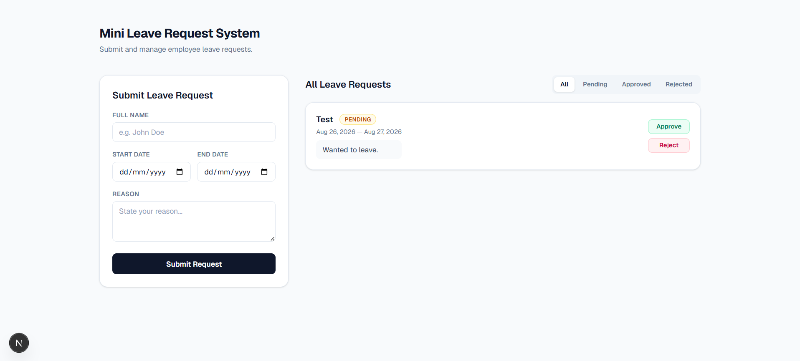

# Mini Leave Request System

Next.js application for managing employee leave requests. Features server-side validation, persistent local JSON storage, and status filtering.

## Tech Stack
- Next.js
- Tailwind CSS

## Prerequisites
- Node.js 
- npm

## Local Installation

1. Clone the repository:

   ```bash
   git clone https://github.com/Jujulka26/mini-leave-request-system.git
   cd mini-leave-request-system
   ```

2. Install dependencies:

   ```bash
   npm install
   ```

3. Run the development server:

   ```bash
   npm run dev
   ```

4. Open [http://localhost:3000](http://localhost:3000) in your browser.

## Usage

- **Submit a request** — fill in name, start date, end date, and reason, then click *Submit Request*. Validation errors appear above the form.
- **Approve / Reject** — pending requests show *Approve* and *Reject* buttons; clicking one updates the status immediately.
- **Filter** — use the All / Pending / Approved / Rejected tabs to filter the list.

Requests are stored in `data.json` at the project root, which ships with a few sample records so the list is not empty on first run.

## Features Implemented
- **End-to-end functionality**: Complete flow from submission to approval/rejection. Data persists in `data.json`.
- **Validation**: Server-side logic ensures all fields exist and `end_date >= start_date`.
- **Extra**: Tailwind CSS UI polish and status filter (All, Pending, Approved, Rejected).

## Screenshot

